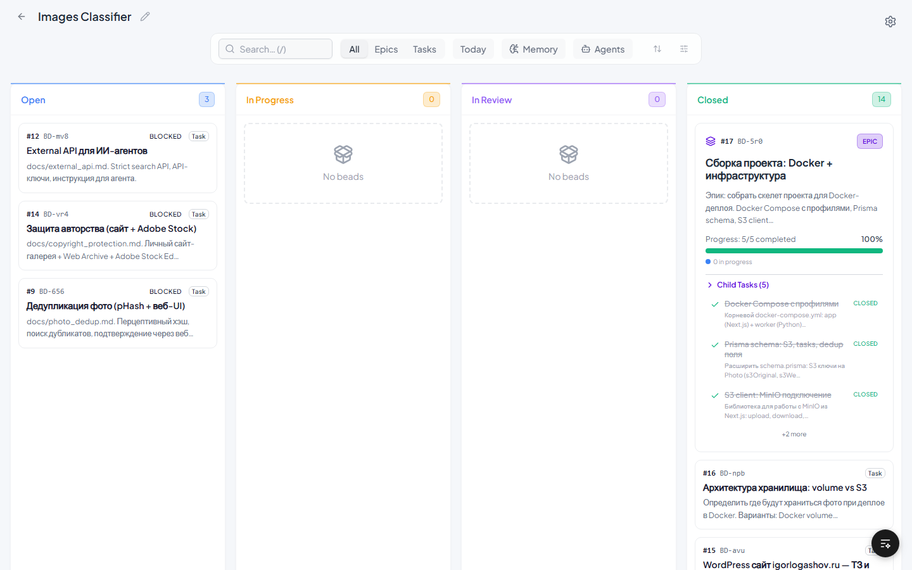
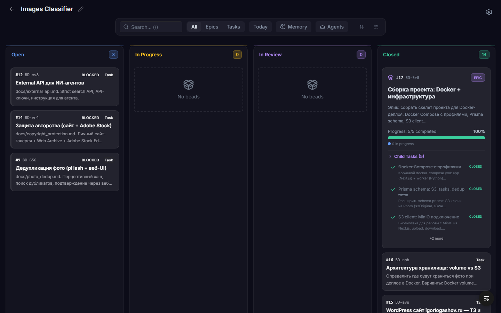
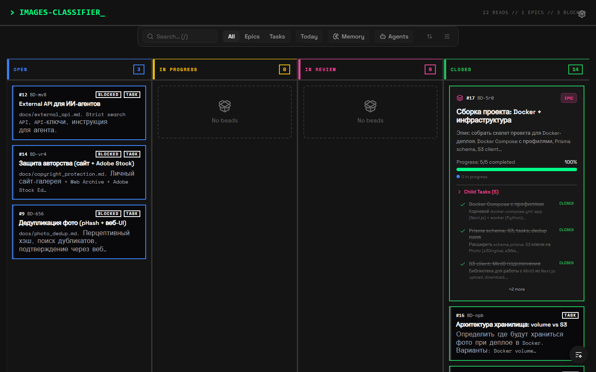
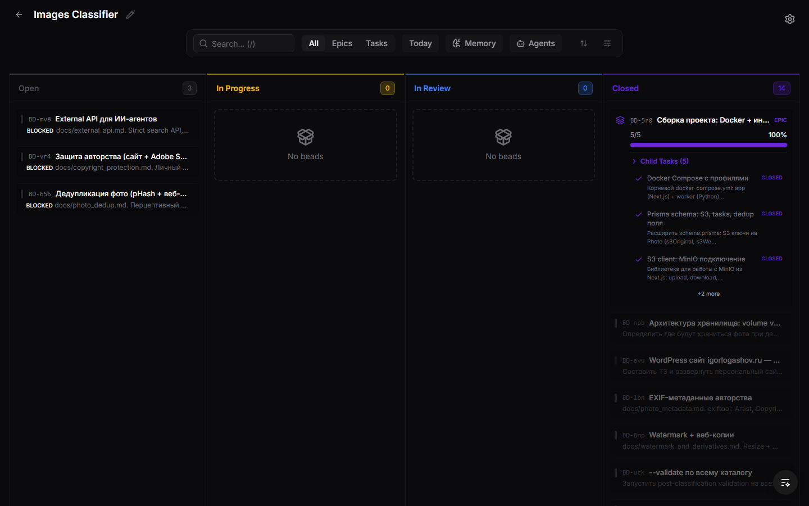
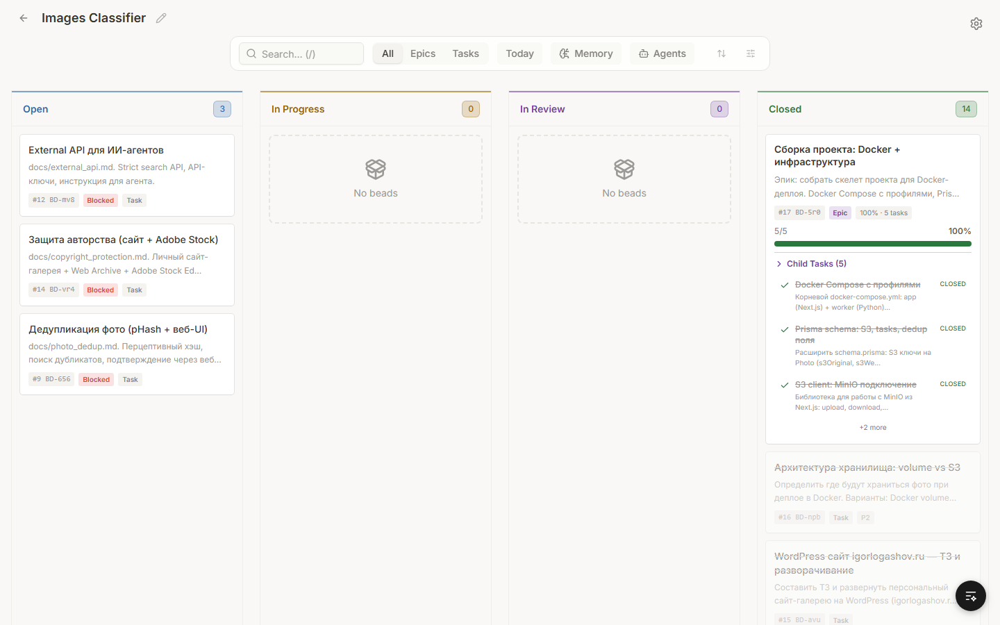
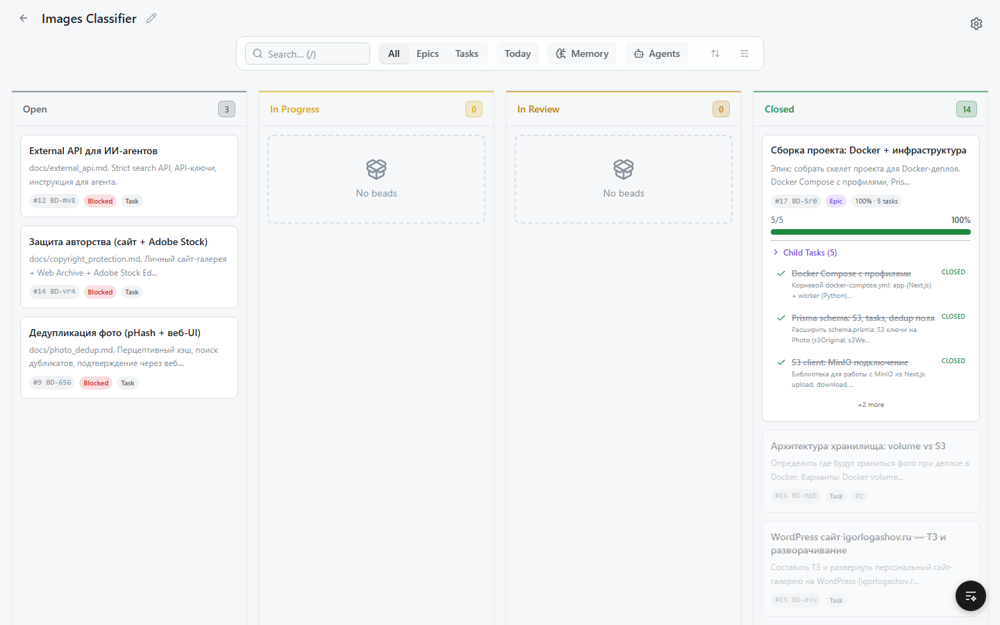

<div align="center">

# BEADS WEB

**Visual command center for beads task tracking.**

[](LICENSE)

<br>



<br>

[Why](#why) · [Origin](#origin) · [Features](#features) · [Themes](#themes) · [Installation](#installation) · [Development](#development) · [FAQ](#faq)

**[Русская версия](README-ru.md)**

</div>

---

## Why

Beads CLI is powerful for task tracking, but:
- No visual overview of task status across columns
- No drag-and-drop to move tasks between states
- No way to see epic progress at a glance
- No visual diff between blocked, ready, and in-progress

Beads Web gives you a real-time Kanban board, multi-project dashboard, and git operations — without leaving the browser.

## Origin

Inspired by [Beads-Kanban-UI](https://github.com/AvivK5498/Beads-Kanban-UI) by Aviv Kaplan. The original author appears to have stopped development — PRs go unreviewed for months.

This fork has diverged significantly: 84 files changed, ~9500 lines added.

<details>
<summary>What changed (summary)</summary>

- 7 visual themes with persistence and flash prevention
- Inline editing for bead fields (click to edit title, description, notes)
- Click-to-copy bead IDs
- Dolt direct SQL integration (no filesystem needed)
- One-click project discovery from Dolt databases
- Windows multi-drive path support
- File browser for adding projects
- Decomposed components (bead-detail, epic-card, etc.)
- Vitest test setup
- Full component decomposition and refactoring
- Drag-and-drop status updates

</details>

Full changelog with rationale: [docs/changelog.md](docs/changelog.md)

## Features

- **Multi-project dashboard** — all projects in one place with status donut charts
- **Kanban board** — Open → In Progress → In Review → Closed with drag-to-update
- **Epic support** — group tasks with visual progress bars, view subtasks
- **GitOps** — create, view, and merge PRs from the board. CI status, merge conflicts, auto-close
- **Memory panel** — browse, search, edit knowledge base entries
- **7 themes** — Default Dark, Glassmorphism, Neo-Brutalist, Linear Minimal, Soft Light, Notion Warm, GitHub Clean
- **Dolt integration** — connect to Dolt databases directly, no filesystem path needed
- **Real-time sync** — SSE file watcher for local projects, polling for Dolt

## Themes

Soft Light theme is shown in the main screenshot above.

<details>
<summary>See all 7 themes</summary>

**Default Dark**


**Glassmorphism**


**Neo-Brutalist**


**Linear Minimal**


**Notion Warm**


**GitHub Clean**


</details>

## Tech Stack

- **Frontend**: Next.js 14, React 18, TypeScript, Tailwind CSS, Radix UI, dnd-kit
- **Backend**: Rust (Axum), SQLite, Dolt SQL
- **Build**: Static export embedded into Rust binary via rust-embed

## Installation

### Prerequisites

- Node.js 20+
- Rust toolchain (cargo)
- Beads CLI (`bd`)

### Build & Run

```bash
git clone https://github.com/weselow/beads-web.git
cd beads-web
npm install
npm run build
cd server && cargo build --release
./server/target/release/beads-server
```

Open http://localhost:3007

## Development

```bash
# Terminal 1: Frontend dev server
npm run dev

# Terminal 2: Rust backend
cd server && cargo run
```

Note: `next dev` requires commenting out `output: 'export'` in `next.config.js`.

## FAQ

**Q: Do I need Dolt?**
A: No. Beads Web works with local filesystem projects using `bd` CLI. Dolt adds direct SQL access and remote database support.

**Q: How do I add a project?**
A: Click "Add Project" on the dashboard. Browse to your project folder or enter a `dolt://` URL.

## Credits

- [Beads-Kanban-UI](https://github.com/AvivK5498/Beads-Kanban-UI) by Aviv Kaplan — original project
- [beads](https://github.com/steveyegge/beads) by Steve Yegge — git-native task tracking
- [Claude Protocol](https://github.com/weselow/claude-protocol) — orchestration framework (works great together)

## License

MIT
